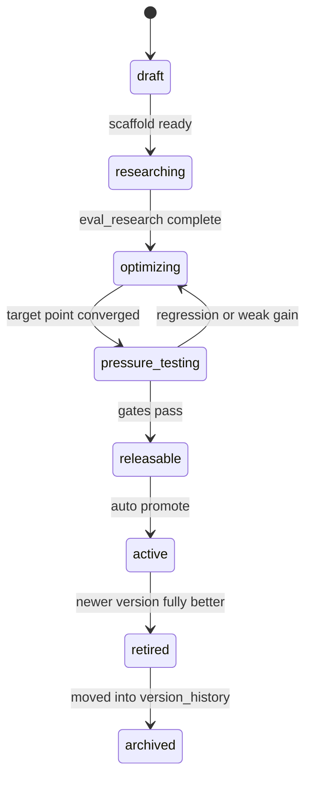

# 自演化抗脆弱的联邦 Skill 系统白皮书

### awesome-skill-creator 执行规格与联邦进化协议

> **结论**
> - 这份文档不再把 `awesome-skill-creator` 写成理念集合，而是写成一套可执行 contract。
> - 系统的最小闭环是：单点攻破、append-only eval、真实 blind eval、零回归升级、失败入档、5 分钟心跳续跑。
> - `awesome-skill-creator-v1` 的首要任务不是“多创建几个 skill”，而是“自举产出更好的 v2，并用同一流程持续推动 v3+ 和全部自建 skill”。

> **文档性质**
> - 面向 `awesome-skill-creator`、它创建出来的下游 skill、以及未来接手这个系统的人。
> - 本文回答三件事：系统为什么这样设计，一轮进化怎么跑，什么情况下允许自动升级或自动扩张联邦。

## 一、系统目标与硬约束

### 1.1 系统要解决什么问题

`awesome-skill-creator` 不是一个”帮人写出初版 skill 模板”的脚手架，而是一个可以持续进化 skill 的元系统。它要把”写 skill”从一次性交付，改造成长期运行的研究流程。

这个系统的第一阶段目标很具体：创建 `awesome-skill-creator-v1`，让它用自己的流程产出更好的 v2；当 v2 相比 v1 全面提升时，自动升级为当前版本；然后以同样的协议继续推进 v3、v4，以及所有由它创建出来的 skill。

换句话说，系统不是为了证明”可以生成 skill”；系统是为了证明”skill 的质量可以被持续、可审计地推进，而且推进过程不会靠删 case、改口径、忽略失败来伪造进步”。

**零样本特性（Zero-Shot Generalization）**是这个系统的内在约束，也是其设计的核心出发点之一。在为一个全新领域（绘图、法律、金融等）创建 skill 时，不存在任何可用的标注样本、领域历史基线或经过领域适应的 judge——整套质量评估体系必须在创建 skill 的同一 session 内从零搭建。`.step0.yaml` 的目标先行设计、`judge_calibration` 的双向校准、以及 failure-mode-first 的评测哲学，正是在零样本约束下替代”训练信号”的工程解法。

### 1.2 不可退让的硬约束

下列约束不是建议，而是准出门槛：

1. 每轮只攻一个优化点。没有单点，就没有可解释的因果。
2. 评测集只能增加，不能删除历史用例；允许新增分级标签，但不允许通过删旧 case 伪造提升。
3. 新增 feature 绝不能导致之前已优化 feature 的损失；否则该轮优化判定为失败。
4. 评测必须包含真实 LLM 调用，`run_eval.sh` 和 `run_blind_eval.sh` 不能是占位脚本。
5. 正式 eval 前必须先做 preflight，先证明方案“至少奏效”，再跑完整评测。
6. 盲评必须包含“带 skill 的版本”与“裸 LLM 版本”对照；没有对照，就无法证明 skill 的增值性。
7. 只要新版本相对上一版本是全面提升，就自动升级，不需要用户再确认。
8. 成功和失败都必须入档；失败原因缺失，视为这轮优化没有完成。
9. 每 5 分钟执行一次心跳；心跳不能只报状态，必须推动真实的研究、评测、迭代或归档动作。
10. 如果流程里缺了关键能力，例如缺少”写 arXiv 级文章”的能力，这不是备注，而是缺口；系统要自动补齐。
11. **预测值不是证据**。`eval_report.json`、`blind_eval_report.json`、`stress_report.json` 中的结果必须来自真实执行；任何未经实际运行产生的结果必须显式标注 `execution_status: predicted` 并视为**无效证据**，不能参与准出判断或自动升级决策。`run_eval.sh`（或等价脚本）必须对每条 case 实际调用 skill-creator 并检查输出，不接受人工填写的通过结论。
12. **评测 fixture 不得污染主目录**。`run_eval` 创建的临时 skill 目录（用于文件断言验证的 fixture）必须统一存放在 `.tmp/eval/<技能名>_<版本>/` 下，路径约定为相对于项目根目录。例如验证 `skill-creator-v3` 时，所有 fixture 目录放在 `.tmp/eval/skill-creator_v3/` 中，不得在项目根目录散落。`.tmp/` 应加入 `.gitignore`，不进入版本库。
13. **精简是进化的合法方向**。同等能力下更少的复杂度意味着更高的抗脆弱性——每一行多余的流程都是未来失败的潜在来源。「删除冗余」和「增加能力」都是合法的进化动作；系统不能因为某版本「只是变得更简洁」而拒绝承认其为进步。
14. **参考抄录强制**。所有 eval_research 中 `design_impact ≠ context_only` 的文献必须生成结构化参考卡片并存入 `assets/references/`，绝对数量 ≥3。参考卡片是准出必要条件，不是附录；缺失则不允许进入 ship 阶段。这条约束的意义在于：「读了但没有抄录」与「没读」在可审计性上等价——下一版本无法从未落盘的阅读中继承任何知识。

### 1.3 非目标与反例

这个系统不追求“一次写对”，也不追求“先做漂亮叙事，后补执行细节”。下面三类做法都不算完成：

1. 只生成一份看起来完整的 `SKILL.md`，但没有真实 eval、blind eval 和升级门禁。
2. 一轮里同时改 prompt、改评测、改目录、改流程，然后用“整体感觉更好了”宣称进步。
3. 因为旧 case 难过，就把旧 case 删除，或者把目标说窄，来换取一份看似更高的通过率。

反例很直接：如果一个绘图 skill 新增了“风格化主题切换”，却让原来已经做好的“动态效果稳定性”退化，这一版不能算进步，哪怕新生成的图片更惊艳也不行。

### 1.4 首个重点目标域：绘图 skill

虽然这份白皮书聚焦的是 `awesome-skill-creator`，但它的第一个重点目标域已经被明确提出：创建一个高质量的绘图 skill，并把它作为 creator 的重点验证对象。

这个绘图 skill 至少要满足四类能力：

1. 交给 agent 后，可以自然地产出“非常好的图像”，而不是只会拼 prompt。
2. 图像要支持强风格化表现，而不是只有单一审美。
3. 要能切换主题，说明系统处理的是“风格空间”，不是单点模板。
4. 要支持动态效果，说明目标不止是静态图，而是包含时间维度的表现。

因此，creator 在面向绘图 skill 做调研与评测时，至少要覆盖五个研究方向：

1. 图像生成与编辑链路，包括文生图、图生图、局部编辑、风格迁移、角色一致性。
2. 风格系统设计，包括主题切换、风格约束、审美一致性、多变体生成。
3. 动态内容生成，包括关键帧、镜头一致性、时序平滑、短视频或动画片段生成。
4. 可评测性设计，包括画质、构图、风格一致性、时间一致性、用户偏好对和 blind eval。
5. 工程落地链路，包括模型路由、成本控制、素材缓存、失败重试、版权与安全约束。

如果 creator 连自己的首个重点目标域都无法拆成研究维度、评测维度和失败模式，它就还不是一个合格的 creator。

## 二、版本状态机与目录约定

### 2.1 版本状态机

`awesome-skill-creator` 以及所有联邦 skill，都必须遵循同一套状态机。状态不是展示字段，而是调度器和升级器的输入。



其中有两个特别字段必须可机器读取：

1. `bootstrap_completed`：这个版本是否已经完成“产出下一版本并通过门禁”的自举。
2. `status`：`draft | researching | optimizing | pressure_testing | releasable | active | retired | archived`。

### 2.2 Frontmatter 与元数据 contract

**`SKILL.md` frontmatter** 仅包含 Claude Code slash command 所需的两个字段：

| 字段 | 类型 | 作用 |
|------|------|------|
| `name` | string | Slash command 名称（不含版本号，如 `skill-creator`） |
| `description` | string | Slash command 描述，必须含领域核心词汇 |

**调度器字段**（以下字段均在 `manifest.yaml` 中，不属于 SKILL.md frontmatter）：

| 字段 | 类型 | 作用 |
|------|------|------|
| `name` | string | 版本化 skill 名称，如 `awesome-skill-creator-v2` |
| `family` | string | 稳定家族名，如 `awesome-skill-creator` |
| `version` | string | 当前版本号 |
| `status` | enum | 当前状态机状态（`draft\|researching\|optimizing\|pressure_testing\|releasable\|active\|retired\|archived`） |
| `bootstrap_status` | enum | 自举阶段（`genesis\|objective_bootstrapping\|subjective_bootstrapping\|mature`） |
| `bootstrap_completed` | bool | 是否已完成自举目标（产出下一版本并通过门禁） |
| `bootstrap_target` | string | 当前版本要产出的下一版本，如 `v1` |
| `creator_version` | string | 创建本版本所使用的 creator 版本 |
| `parent_version` | string | 上一版本（genesis 版本填 `null`） |
| `auto_upgrade_policy` | string | 默认 `all_ge_old_and_one_gt` |
| `latest_alias` | string | 稳定入口名，如 `awesome-skill-creator` |

如果 manifest.yaml 中调度器字段缺失，调度器无法确定”该不该继续跑””该不该升级””该不该退休”，所以视为结构不完整，不能准出。

### 2.3 目录 contract

目录不是装饰，它决定心跳如何发现 skill、如何定位评测、如何追溯失败。

```text
awesome-skill-creator -> awesome-skill-creator-vN

skill_archives/
  awesome-skill-creator/
    awesome-skill-creator-v1/
    awesome-skill-creator-v2/

awesome-skill-creator-vN/
  SKILL.md
  process.md
  scaffold.md               # 创建下游 skill 的脚手架规范
  self-bootstrap.md         # 自举协议
  manifest.yaml
  .step0.yaml               # 目标定义与失败模式
  .skillignore
  locks/
    evolve.lock
    promote.lock
    register.lock
  evals/
    objective_cases.yaml    # 所有客观层 case（append-only）
    eval_protocol.md        # 评测协议说明
    eval_research/
      literature_review.json
      frontier_impls.json
      tool_analysis.json
      edge_cases.json
      user_scenarios.json
  tools/
    validate.sh             # 顶层 shim（向后兼容入口）
    gate/                   # 只读验证器（无副作用）
      _lib.sh
      validate.sh
      validate_structure.sh
      validate_manifest.sh
      validate_evals.sh
      validate_article.sh
      validate_ref_cards.sh
      validate_references.sh
      checklist.md
    scripts/                # 生成器与执行器（有副作用）
      gen_skill_dir.sh
      gen_ref_card.sh
      gen_dist.sh
      run_eval.sh
      run_blind_eval.sh
      suggest_p2_candidates.sh
  evolve_history/
    vN/
      genesis.md            # 仅首个版本或家族创建版本使用
      summary.md            # 非 genesis 版本必填
      target_point.md
      comparison.md
      release_checklist.md
      attempts/
        attempt-001/
          hypothesis.md
          diff.md
          preflight.json
          eval_report.json
          blind_eval_report.json
          stress_report.json
          verdict.json
      failures/
      article/
      evolution.md
      assets/
        references/         # ref_*.md 参考卡片，每篇论文一张
  version_history -> ../skill_archives/awesome-skill-creator/
```

这里有一个强约束：旧版本不要直接躺在新版本根目录里，而是通过当前版本暴露出来的 `/version_history` 查看；但真正的归档根必须是稳定地址，例如 `skill_archives/<family>/`。这样既满足“老版本不在新版本根目录里散落”，也避免每次升级都搬动历史目录，导致旧引用失效。

### 2.4 稳定入口、自动升级与退休

联邦里每个 skill 都有两个名字：

1. 版本名，例如 `awesome-skill-creator-v3`。
2. 稳定入口名，例如 `awesome-skill-creator`。

当 `v{N+1}` 满足升级门禁时，系统按顺序执行：

1. 获取 `promote.lock`。
2. 将 `v{N+1}` 标记为 `active`。
3. 将 `v{N}` 标记为 `retired`。
4. 更新稳定入口软链接，使 `awesome-skill-creator -> awesome-skill-creator-v{N+1}`。
5. 确保 `skill_archives/<family>/v{N}` 的归档条目存在；若不存在则写入，不允许移动已有归档路径。
6. 确保新版本中的 `version_history` 只读指向该稳定归档根。
7. 释放锁并广播升级事件。

这个过程不需要用户确认；用户只在想暂停系统、改预算或改目标时才需要介入。

### 2.5 并发冲突控制

“每 5 分钟心跳 + sub-agent 并行调研 + 自动升级”天然会打架，所以必须显式加锁。最低要求如下：

1. `federation scan` 只持读锁，不阻塞其他 skill 的执行。
2. 单个 skill 进入研究、优化、压测时，必须持有该 skill 的 `evolve.lock`。
3. 版本切换和软链接更新必须持有 `promote.lock`。
4. 新 skill 创建必须持有联邦级 `register.lock`，并按 `family` 或缺口名做去重检查，防止同一缺口被并发创建两次。
5. 同一个 skill 不允许同时跑两轮优化；发现重入时，后到任务直接退出并记录原因。
6. 心跳只负责触发，不绕过锁直接修改状态。

没有锁，系统就会在最有价值的时候失真：你会看到“同时两轮都认为自己是最新版本”的假阳性结果。

## 三、主流程与心跳循环

### 3.1 单轮进化主流程

`awesome-skill-creator` 的标准流程必须按下面的顺序执行，不能跳步，也不能把多步混成一句“持续优化”：

1. **优化点分析**：只选一个点，明确它为什么是当前最值得攻破的瓶颈。
2. **前沿调研（Frontier-First，两种模式二选一）**：在动手设计之前，必须先判断调研模式，再执行对应流程——两种模式混用会导致探索型调研带预设方案、问题型调研脱离目标：
   - **问题型（P）**：由 eval fail case 触发。必须先用 PICOC 框架写出问题陈述（`observed_behavior` + `expected_behavior` + `problem_type`），再进行精准文献搜索。对每篇结果标注 `frontier_coverage: solved / partial / none`；只有 ≥3 篇均为 `none` 时才允许自研，此时记录 `design_source: self_invented`。**`self_invented` 是最后手段，不是默认选项。**
   - **探索型（E）**：由版本稳定、寻找下一优化方向触发。宽泛调研 ≥5 篇，产出 gap analysis，选出单一 `target_point`。

   无论哪种模式，每条调研发现都必须有具体来源（论文标题 / URL / 会议名），并在研究影响矩阵中标注 `design_source` 字段，使"用了前沿方案还是自研"全程可审计。
3. **bootstrap_new**：生成本轮候选版本和实验假设，写清楚要验证什么，不要直接改正式版本。
4. **基于 agent 的全面调研与对比**：拉起 sub-agent，分别搜集文献、前沿实现、竞品、边界用例、用户场景。
5. **优劣势分析**：把候选方案与当前版本、裸 LLM、竞品方案放在同一张表里比，明确为什么选当前路线。
6. **case 集完善**：把本轮新发现的失败模式写进 eval，且只新增，不覆盖历史。
7. **多轮评审**：先过 preflight，再跑 objective eval、blind eval、必要的 subjective eval。
8. **自我迭代**：只围绕当前单点改动，直到该点达到机器可判定的局部收敛，或被证明短期内无法突破。
9. **压力测试循环**：扩展到长上下文、噪声输入、边界输入、并发场景，确认没有隐性退化。
10. **准出判定**：检查升级门禁、留痕产物、目录完整性。
11. **创建下一版本并归档**：若通过，则自动升级；若未通过，则记录失败，回到第 1 步选下一个点或拆解当前点。

这条主流程是白皮书的中心。没有这条链，整套系统就退化成“心跳触发一些并不确定在做什么的任务”。

### 3.2 每一步必须留下什么产物

每一步都要有明确落盘物，否则下一轮无法继承上下文。

| 步骤 | 必须产物 |
|------|----------|
| 优化点分析 | `target_point.md`，写清目标、瓶颈、放弃的替代点 |
| 前沿阅读 | `eval_research/literature_review.json` 与参考卡片 |
| bootstrap_new | 候选版本目录与实验假设 |
| agent 调研 | `frontier_impls.json`、`tool_analysis.json`、`edge_cases.json`、`user_scenarios.json` |
| 优劣势分析 | `comparison.md` |
| case 集完善 | 新增 eval case 与 `added_in` 记录 |
| 多轮评审 | `preflight.json`、`eval_report.json`、`blind_eval_report.json` |
| 自我迭代 | `attempts/attempt-*` 下的每轮 diff、失败原因、回滚原因 |
| 压力测试 | `stress_report.json` |
| 准出 | `release_checklist.md` |
| 升级或失败 | `evolve_history/vN/summary.md` 与 `failures/` |

如果某一步没有产物，就意味着系统只能“记得最后一次成功”，而记不住“为什么这次失败”，这正是脆弱系统的典型症状。

### 3.3 5 分钟心跳要做什么

心跳默认每 5 分钟运行一次。它不是 cron 版的“打印一句 still alive”，而是联邦总调度器。每次心跳必须按顺序做四件事：

1. 找到当前稳定入口指向的最新 creator。
2. 检查最新 creator 是否已经完成自举；如果没有，优先继续它自己的单轮进化。
3. 用最新 creator 的流程和评测框架，重评所有由它创建出来的 skill；只要发现可量化提升空间，就触发对应 skill 的下一轮进化。
4. 检查流程缺口和能力缺口；如缺少必要 skill，则进入自动补齐流程。

心跳的核心含义是：creator 每升级一次，联邦里所有自建 skill 都会被更高标准重新审视一次。

### 3.4 Sub-agent 编排原则

creator 不是单线程写作者，而是 orchestrator。初始创建阶段就要拉起 sub-agent 去补足 `eval_cases` 和 `eval_research`，后续每轮进化也一样。最低配的 sub-agent 分工如下：

1. `literature-research`：查论文与方法脉络。
2. `frontier-impl-analysis`：查最前沿实现与工程手法。
3. `tool-analysis`：查竞品和邻近系统的优劣。
4. `edge-cases`：专门挖边界失败和反例。
5. `user-scenarios`：补真实使用场景和任务形态。

这些 agent 可以并行启动，但汇总时必须回到统一 schema。否则研究看起来很热闹，最后却无法进入 eval 和升级门禁。

### 3.5 流程缺口与能力缺口的自动补齐

这里要区分两种缺口：

1. **流程缺口**：主流程里本应存在的步骤缺失了，例如没有“写 arXiv 级文章”的能力，导致版本无法准出。
2. **能力缺口**：当前联邦根本没有某种基础能力，例如没有“结构化参考卡片生成” skill。

对于这两种缺口，默认策略都不是“等人拍板”，而是：

1. 由心跳或失败分析发现缺口。
2. 先获取联邦级 `register.lock`，并用 `family`、缺口名和 manifest 指纹做去重。
3. 由当前最新 creator 拉起 sub-agent，创建目标 skill 的候选版本。
4. 对新 skill 跑独立验收和 blind eval。
5. 验证通过后自动纳入联邦，并在后续心跳中接受同样的进化流程。

也就是说，联邦的扩张默认是自动的；真正需要人类介入的是改预算、改停止条件、改系统目标，而不是给每个新 skill 批条子。

### 3.6 停止条件、重试与预算

“不要停下来”不等于“无限盲跑”。系统必须在持续推进和避免无效消耗之间做硬切分：

1. 同一优化点必须至少尝试 2 条实质不同的路线，不能只改措辞后就宣布“已穷尽”；“不同路线”要求 `hypothesis.md` 中的机制假设不同，而不只是 prompt 改写。
2. 平台期的比较基线固定为两组：当前 `active` 版本，以及当前优化点下的历史 `best attempt`。
3. “核心客观指标”固定指 `P0 pass rate`、`blind additionality`、`pressure pass rate`、`cost per pass` 四项；其中前三项越高越好，最后一项越低越好。
4. 若连续 3 个 `attempt` 相比“当前 `active` 版本”和“历史 `best attempt`”都没有出现任一核心指标的严格改善，且 `blind additionality` 提升小于 2 个百分点，则判定该优化点进入平台期。
5. 若连续 2 个 `attempt` 都在同一类 preflight 或 pressure test 上失败，且失败归因一致，则判定当前瓶颈不是微调可解，必须拆点或转为缺口检测。
6. 只有当“平台期”与“替代路线已尝试”同时成立时，才允许写出“当前点已优化到局部极限”的结论。
7. 同一类 blind eval 如果连续失败，必须先修复 preflight，再继续跑大规模评测。
8. 心跳可以不断触发，但每个 skill 都要受预算、token、并发数和最长运行时长约束。

没有停止条件，系统会把“持续进化”误解成“持续烧钱”。

## 四、客观层评测协议

### 4.1 为什么客观层必须先成熟

在 `awesome-skill-creator` 体系里，客观层不是“最低标准”，而是主观层的前置条件。一个 skill 还在频繁犯结构错误、事实错误或流程错误时，人类对“哪个更好看、哪个更像专家”的判断会被噪声污染。此时收集主观偏好，等于把错误包装成风格选择。

所以顺序必须是：先把客观层做到可用，再引入主观层加速；可以并行准备，但主观层结果在客观层未成熟前不能参与自动升级。

### 4.2 Eval case schema

每条客观层 case 至少包含这些字段：

```yaml
id: eval_case_001
description: 简短说明这条 case 验证什么
input: 用户触发 skill 的原始 prompt
context: 可选的前置上下文
assertions:
  # 五种断言类型（二选一或组合）：
  # contains / not_contains: 检查输出中是否包含/不包含指定文本
  # min_count / max_count: 检查输出中某模式的出现次数下/上限
  # run_script: 执行 shell 脚本，用 exit code 判断通过/失败
  # invoke_skill_judge: 调用 LLM judge 对输出做主观质量判断
  # judge_calibration: meta-oracle，用已知好/坏样本双向校验 judge_prompt 质量
  - type: run_script | contains | not_contains | min_count | max_count | invoke_skill_judge | judge_calibration
    value: 期望值或脚本路径
expected_result: pass | fail
evolution_direction: “（当 expected_result: fail 时必填）失败时应如何改进”
source: human_designed | agent_generated | frontier_paper | failure_log
added_in: vN
target_point: 本轮攻克的优化点
tier: P0 | P1 | P2                          # P0 不可删；P1 日常参与；P2 已归档
superseded_by: eval_case_xxx               # 仅 P2 case 必填，指向取代者
gsb_baseline:                              # 可选；用于增值性评估
  bare_llm_expected: “裸 LLM 预期行为描述”
  skill_advantage: “Skill 应优于裸 LLM 的具体方面”
```

关键字段说明：

1. `expected_result`：区分当前必须通过的基线 case，和”本轮暂时预期失败、但必须被记录下来”的前瞻 case。
2. `evolution_direction`：当 case 预期失败时，指明修复方向；防止失败 case 只记录”失败”而不给出改进线索。
3. `tier`：P0/P1/P2 三级保护机制——P0 是核心约束不可删；P1 是日常活跃约束；P2 是被更强 case 取代的归档约束，通过 `superseded_by` 指向取代者，历史可追溯但不参与日常通过率统计。
4. `gsb_baseline`：可选的增值性分析字段，配合 `run_blind_eval.sh` 做 Good/Same/Bad 基线对比。

### 4.3 评测维度与真实执行要求

客观层至少覆盖五个维度：

1. **正确性**：输出格式、逻辑、执行结果是否正确。
2. **覆盖度**：是否能处理它声称能处理的任务、边界和异常。
3. **一致性**：多次运行、跨版本运行时是否语义等价。
4. **增值性**：相对于裸 LLM，skill 是否真的让结果更好。
5. **效率**：在同等质量下，token、步骤数、文件数、人工介入是否更少。

执行上必须满足：

1. `run_eval.sh` 跑真实任务，不接受 mock 通过。
2. `run_blind_eval.sh` 同时跑带 skill 与裸 LLM 两条路径，并输出 GSB 结果。
3. 正式评测前先跑 `preflight`，最少过一组 sanity cases，证明新策略值得进入完整评测。

“cases 太简单”本质上不是题目少，而是没有能力区分好坏。一个合格评测集必须能稳定打出三类结果：当前版本能过、裸 LLM 会差、候选坏方案会暴露问题。

**Eval case 最低数量与覆盖率要求**：eval case 总数 ≥10（≥4 pass，≥4 fail）；`.step0.yaml` 中定义的每一个 `failure_mode` 必须有 ≥1 专属 fail case + ≥1 对应 pass case（`failure_mode_id` 字段覆盖率 100%）；三个维度（correctness / coverage / consistency）各 ≥2 条；`source: frontier_paper` case ≥3 条。数量是覆盖广度的下限，不是目标——设计时先列出所有失败模式和进化方向，逐一配对 case，最后检查遗漏，而不是先凑够数量再反推断言。

### 4.4 自动升级门禁

自动升级必须满足 `all >= old and at least one > old`，但这句话必须展开成机器规则：

1. 历史 `expected_result: pass` 的 case 全部通过。
2. 历史 blind eval 的增值率不低于上一版本。
3. 没有任何已优化 feature 出现退化。
4. 至少一个核心指标严格提升，提升可以来自质量，也可以来自同质量下的复杂度下降（精简度指标：token 消耗降低、步骤数减少、文件数减少、eval case 平均执行时间降低）。
5. `evolve_history`、Article、Evolution、研究卡片、失败归因全部齐全。
6. 当前没有其他正在推进中的同 skill 进化任务。

如果只满足“新增场景更强”，但旧场景退化，这一版一票否决；如果质量相同但流程更短、token 更少、文件更少，这一版仍然算合法进步。

### 4.5 不能删 case，只能追加分级

`only-increase` 原则是这套系统最关键的防作弊机制。允许删 case 的后果很直接：系统可以靠缩小承诺范围伪装成”更强”。这与进化的方向完全相反。

唯一允许的演化是新增分级和新增解释。awesome-skill-creator 引入了 P0/P1/P2 三级保护机制：P0 是核心约束（不可删、不可减弱）；P1 是当前活跃约束（默认参与 eval）；P2 是已归档约束——它被更强的 case 取代，通过 `superseded_by` 字段指向取代者，历史判定仍然可追溯，但不参与日常 eval 通过率统计。P2 归档不等于删除，审计时 `--all-tiers` 仍可完整重现。

**长期风险（EWC 容量炸弹）**：随着版本迭代，P0/P1 约束空间只增不减。到 v5+ 时，历史约束积累可能阻碍需要大幅重构的架构变更。P2 归档机制是当前的缓解手段，但如果某次进化需要彻底替换核心假设（而不只是替换单个 case），系统需要显式声明「架构不兼容变更」并执行受控的 case 集迁移——这超出了当前 only-increase 的协议范围，需要未来版本专门设计。

### 4.6 从弱规则到强规则的改写示例

下面是一个必须出现在白皮书里的改写示例，因为它精确说明了为什么“泛化理念”不够：

原句：

> 客观层全面提升时，自动升级。

改写后：

> 只有当历史 `pass` 用例 100% 通过、blind eval 增值率不低于上一版、无已优化特性回归、至少一项核心指标严格提升、且持有 `promote.lock` 时，系统才自动把稳定入口切到新版本。

为什么后者更好：

1. 它给出了机器可判定的条件，而不是留给人脑脑补。
2. 它把“全面提升”拆成了可审计的多个维度。
3. 它把升级动作和并发控制绑定在一起，避免出现双活版本。

## 五、主观层与联邦进化

### 5.1 主观层的启动时机

主观层处理的是“更好看”“更像专家”“更符合特定领域审美”这类没有唯一标准的质量判断。它很重要，但不能抢跑。

对绘图、写作、交互等 skill 来说，主观层最终决定上限；但在客观层还不稳时，主观层只会把风格偏好和结构错误混在一起。系统应先成熟客观层，再让主观层参与升级门禁。

### 5.2 Bootstrap 最低门槛

主观层进入部分自动化前，至少满足：

1. 50 组以上人类偏好对。
2. 覆盖至少 5 个不同评判维度。
3. 至少 2 位有领域判断力的人提供标注或修改行为。
4. 每个版本都围绕当前优化点做过足够的论文阅读和案例阅读。

达到这个门槛后，才允许训练或校准 judge model；否则主观层结果只能做参考，不能做自动升级依据。

### 5.3 Judge 异构与校准

主观层最大的风险不是”判断慢”，而是”judge 和被评系统一起漂移”。因此至少要做三件事：

1. judge 尽量与被评 skill 使用不同模型基座或不同评测提示框架。
2. 每隔固定版本回抽历史偏好对，做人类锚点复核。
3. 如果主观层出现”某项大涨、另一项大跌”，默认不自动升级，先回到权重和目标审查。

**Judge 本身的质量验证（⭐v7 新增）**：judge_prompt 的质量无法自假设——过严的 judge_prompt 会把好输出判为 FAIL，过宽的会把坏输出判为 PASS，两种错误都会使 eval 结论失真。v7 引入 `judge_calibration` 断言（meta-oracle）：用已知 good_example / bad_example 对 judge_prompt 做双向校验。任一方向失败则强制要求修正 judge_prompt。所有包含 `invoke_skill_judge` 断言的 eval 套件，都必须有至少一条 `judge_calibration` 断言作为 oracle 质量保证。

客观层是防错，主观层是拉高上限；二者混着用，系统会越来越会讲故事，却不一定越来越可靠。

### 5.4 联邦中的统一进化协议

所有由 creator 创建出来的 skill，都必须接受“当前最新版 creator”的重新审视，而不是永远冻结在它出生时的流程里。

这意味着：

1. 心跳遍历的是“所有自建 skill”，不是只盯着 creator 自己。
2. 这些 skill 的新一轮进化，必须使用最新 creator 的 `process.md` 和评测框架。
3. creator 每升级一次，联邦里所有自建 skill 都会获得一次被新标准重跑的机会。

如果没有这条规则，联邦里会快速出现“第一代 skill 永远停留在第一代标准”的化石层。

### 5.5 自动扩张、注册与退休

联邦中的 skill 通过 `manifest.yaml` 被发现和注册。默认策略如下：

1. 新 skill 通过缺口检测或流程缺口修复产生。
2. 一旦独立验收通过，就自动注册进联邦。
3. 注册后立即进入心跳管理和 append-only eval 体系。
4. 当一个 skill 连续多个心跳周期没有产生增值，或者长期没有上游依赖，可以进入 `retired` 或 `archived`。

这里必须把 blind eval 写成退休协议，而不是背景指标。默认退休触发器如下：

1. 对比裸 LLM 的 GSB blind eval 增值率连续 3 个心跳周期低于 30%。
2. 同一窗口内 `Bad > Good`，说明 skill 已经开始制造净负效应。
3. 最新 creator 针对该 skill 至少执行 2 轮单点修复，仍未把增值率拉回阈值以上。
4. 客观层没有新增强信号能够证明“只是评测框架暂时看不见它的价值”。

满足以上 4 条后，系统直接把该 skill 标记为 `retired`；若它同时连续 10 个心跳周期没有被任何上游依赖引用，则进一步进入 `archived`。如果后续出现新 case、新上游依赖或新 creator 带来的明确修复路线，`retired` skill 可以被重新激活，但历史退休记录不得删除。

这里的“退休”不是删除知识，而是停止继续消耗资源。旧版本代码、失败记录、参考卡片、blind eval 结果都必须保留。

## 六、产物、留痕、写作规范与治理边界

### 6.1 evolve_history 是系统记忆，不是附录

每个版本在 `evolve_history/vN/` 下至少保留五类内容：

1. `genesis.md` 或 `summary.md`：记录本轮假设、方法、数据、结论；家族首个版本使用 `genesis.md`，后续版本统一使用 `summary.md`。
2. `attempts/`：按尝试轮次保存完整实验过程，而不是只保留版本摘要。
3. `failures/`：记录失败方案、失败原因、回滚原因。
4. `article/`：产出可独立阅读的 arXiv 水准文章。
5. `evolution.md`：给下一版本的 Top 3 优化建议、依赖关系和攻破顺序。

`attempts/attempt-*` 是硬要求，因为用户要求的不只是“这个版本最后成了什么样”，而是“这个版本内部每次尝试到底改了什么、为什么成功、为什么失败”。每个 `attempt` 至少包含：

1. `hypothesis.md`：本轮只想验证什么，为什么是当前单点。
2. `diff.md`：这轮到底改了什么，不允许只写“做了优化”。
3. `preflight.json`：进入正式 eval 前的奏效验证。
4. `eval_report.json`：客观层评测结果。
5. `blind_eval_report.json`：与裸 LLM 的盲评结果。
6. `stress_report.json`：压力测试结果。
7. `verdict.json`：成功、失败、回滚、平台期、转缺口检测中的哪一种。

如果一个版本里有 7 次失败、1 次成功，`evolve_history` 里就应该能把这 8 次尝试完整回放出来，而不是只在最终文章里用一句“经历多轮探索后成功”带过。

这里有一个硬要求：失败记录比成功摘要更重要。因为未来版本最需要继承的，不是“我们曾经成功过”，而是“哪些路已经被证明不值得再走”。

### 6.2 研究产物 contract

`eval_research` 不是可有可无的资料夹，它是 case 增长和设计决策的来源。最低要求包括：

1. `literature_review.json`
2. `frontier_impls.json`
3. `tool_analysis.json`
4. `edge_cases.json`
5. `user_scenarios.json`
6. `assets/references/` 下的结构化参考卡片

每篇参考卡片都要回答六件事：问题定义、核心方法、实验设计、主要结论、局限性、对当前 skill 的价值。如果没有这些卡片，“阅读论文”很容易退化成“引用几个标题”。

### 6.3 arXiv 级文章的准出要求

每个成功版本都必须产出一篇文章。文章不是宣传稿，而是准出物，至少要覆盖：

1. 为什么选这个优化点，而不是别的点。
2. 本轮使用了哪些研究材料和对比对象。
3. case 集新增了什么，为什么这些 case 能更强地区分好坏。
4. 候选版本、上一版本、裸 LLM 的对比结果。
5. 失败尝试有哪些，为什么失败。
6. 为什么这次升级是合法升级，而不是口径变化。

如果文章无法独立说服不了解上下文的人，这轮进化的可审计性就还不够。

**文章质量必须有 eval 验证**：文章是准出物，不能只靠结构检查（词数、节数、引用数）判定合格。eval 中必须包含：
- ≥1 条 `judge_calibration`：以已知 arxiv 质量的 abstract 为 `good_example`，以空洞通用描述为 `bad_example`，双向校准 judge_prompt 对"可发表性"的区分力。
- ≥1 条 `invoke_skill_judge`：三维评估——每项贡献有引用或数据支撑、Related Work 有差异定位而非只列举、Limitations 有量化描述。

判断依据参考 NeurIPS Reproducibility Checklist：声明必须可证伪，每项声明须附理论或实验证据，局限性须量化。

### 6.4 权衡与反例

这套协议故意比普通“自动化生成工具”更重，因为它优先保护长期可进化性，而不是短期迭代速度。这里有三个常见权衡：

1. **为什么坚持单点攻破**  
   因为多点同时优化虽然更快，但无法确定哪一步真正带来了提升，也无法可靠回滚。
2. **为什么默认自动扩张联邦**  
   因为流程缺口如果每次都等人工审批，心跳会变成半自动待命系统；真正应该限制的是预算和命名空间，而不是把所有扩张都卡在人上。
3. **为什么要强制文章与失败记录**  
   因为没有机构记忆，系统只能依赖当前上下文窗口，下一次很容易重复犯错。

反例同样明确：如果系统发现缺少 `arxiv-writer`，却只在日志里记一句“未来补”，那它实际上没有补流程，只是把问题往后推了一轮。

### 6.5 人类角色与系统上限

在人类不主动暂停系统的默认前提下，人类主要负责四件事：

1. 给出方向性目标。
2. 提供高价值 case，尤其是主观层 case。
3. 调整预算、停止条件和外部约束。
4. 在系统目标变化时重写门禁，而不是临时拍板放行某一轮升级。

系统自身的上限也只有两个：

1. 人类最初提供的目标函数和 case 质量。
2. judge 与 eval 体系的可信度。

除此之外，系统应默认通过研究、评测、盲评、留痕和心跳持续推进，而不是频繁回到“要不要继续”的人工确认模式。

### 6.6 写作指导、相关技能与相关工作

这份白皮书的写法本身也受约束。它不应该写成“高概念 manifesto”，而应该写成别人拿去就能实现的规范文档。写作上，至少参考两类来源：

1. **写作指导**：内部可参考 [`qihan-writing`](/Users/bytedance/.agents/skills/qihan-writing/SKILL.md) 和 [`doc-info-quality`](/Users/bytedance/.agents/skills/doc-info-quality/SKILL.md)；外部可参考 Orwell 的简洁写作原则与 Paul Graham 的技术写作方法。
2. **社区 skills 与相关工作**：可对照 Anthropic Claude Skills、OpenClaw `skill-creator`、`technical-writing`、`brand-voice`、`every-style-editor` 等社区技能做法，避免把“写得像规范”误当成“真的有执行协议”。

方法论上，这套设计同时借了四条成熟路径：RLHF 的偏好采样，持续学习的防遗忘，自举编译器的版本递推，以及 active learning 的高信息量 case 采样。真正的新点不在概念名词，而在于把这些东西压成一套可跑、可升级、可归档的 skill 级协议。
